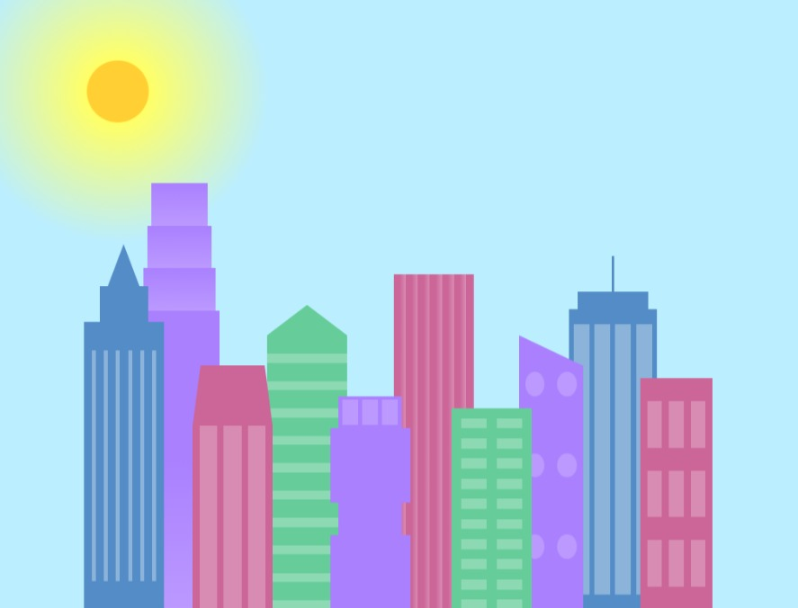
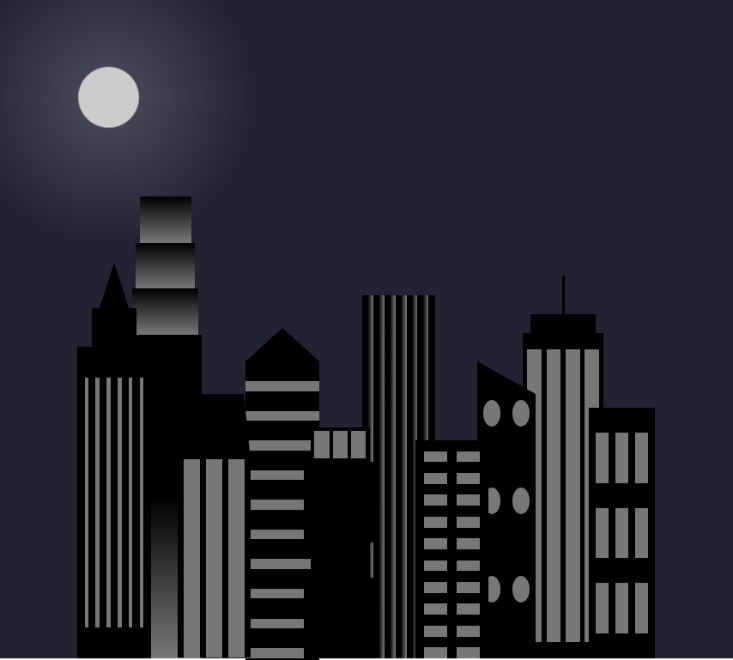

# Skyview Project - CSS Variables

This project showcases a CSS-based visual representation of a city skyline with various buildings and windows, utilizing CSS variables for colors and gradients. The layout adapts to different screen sizes using media queries.

## Table of Contents
- [Demo](#demo)
- [Features](#features)
- [Installation](#installation)
- [Usage](#usage)
- [Screenshots](#screenshots)
- [Contributing](#contributing)
- [Author](#Author)
- [License](#license)

## Demo
A live demo of the project can be viewed [here](https://madokscharles.github.io/skyline-css-variables/).

## Features
- **Responsive Design:** The layout adapts for screens with a width of 1000px or less.
- **CSS Variables:** Utilizes CSS variables for easy theming and color management.
- **Gradients and Shapes:** Uses linear and radial gradients to create the sky and building effects.
- **Flexbox Layout:** The buildings and windows are arranged using flexbox for a responsive and modern layout.

## Installation
To run this project locally, follow these steps:

1. Clone the repository:
   ```sh
   git clone https://github.com/madokscharles/skyview-project.git
   ```

2. Navigate to the project directory:
    ```
    cd skyview-project
    ```

## Usage
Open index.html in your preferred web browser to view the project.

**HTML Structure**
    - **The body contains two main divs:** .background-buildings and .foreground-buildings, each representing different layers of the skyline.
    - **Individual buildings** are defined with classes like .bb1, .fb1, etc., and contain nested elements for different building parts.
**CSS Styling**
    - **Variables:** Defined in the :root selector for easy color management.
    - **Layouts:** Flexbox is used to align and distribute buildings within the container.
    - **Gradients:** Both linear and radial gradients are used to style the sky and building elements.
**Media Query**
A media query is included to adjust styles for screens with a width of 1000px or less:

```@media (max-width: 1000px) {
    :root {
        --building-color1: #000;
        --building-color2: #000;
        --building-color3: #000;
        --building-color4: #000;
        --window-color1: #777;
        --window-color2: #777;
        --window-color3: #777;
        --window-color4: #777;
    }
    .sky {
        background: radial-gradient(
            circle closest-corner at 15% 15%,
            #ccc,
            #ccc 20%,
            #445 21%,
            #223 100%
        );
    }
}
```
## Screenshots
Here are some screenshots of the project:

**Day View**


**Night View**


## Contributing
Contributions are welcome! Please open an issue or submit a pull request for any changes or improvements.

## Author
Madoks Charles - charlesmadoks@gmail.com

## License
This project is licensed under the MIT License. See the LICENSE file for more information.